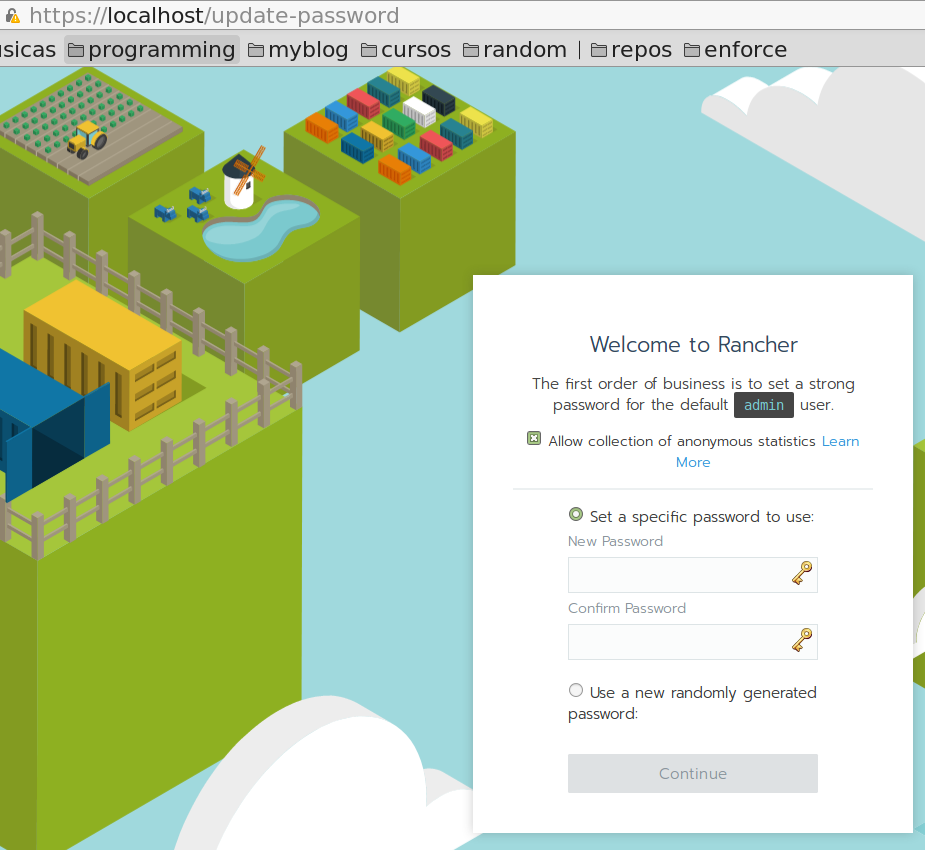
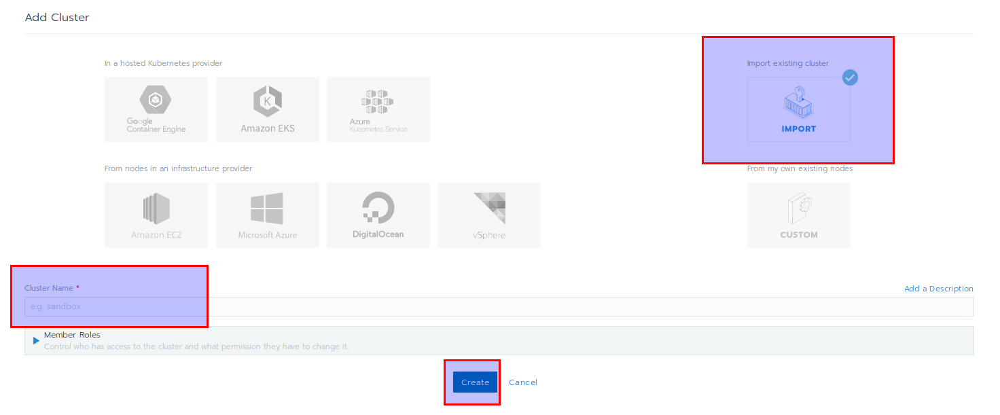
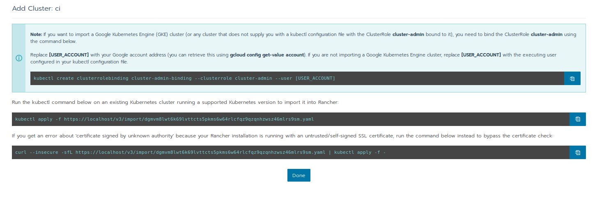

# Configure Rancher & deploy part 1

[comment]: <> (@Author : Gustavo F (gustavo@gmf-tech.com))

[comment]: <> (@Link : <https://github.com/sharkguto)>)
[comment]: <> (@Date : 02/11/2018 13:30:28)

## objectives

The idea of this post is to show how easily is to configure and maintain, a kubernetes infrastructure, using rancher.
In real-world scenario, we should use a k8s cloud provider like EKS,GKE,... but we will use the microk8s project, that simulate a local kubernetes environment.

## pre-requirements

Install the following requirements

1. docker
2. snap
3. A linux machine :)

## install microk8s

install and run microk8s

```bash
gustavo@notebook ~/github-projects/shark-lab $ sudo snap install microk8s --classic
microk8s v1.12.0 from Canonical✓ installed
gustavo@notebook ~/github-projects/shark-lab $
```

check if k8s cluster is running fine

```bash
gustavo@notebook ~/github-projects/shark-lab $ microk8s.kubectl cluster-info
Kubernetes master is running at http://127.0.0.1:8080

To further debug and diagnose cluster problems, use 'kubectl cluster-info dump'.
gustavo@notebook ~/github-projects/shark-lab $

gustavo@notebook ~ $ microk8s.kubectl get node
NAME       STATUS   ROLES    AGE     VERSION
notebook   Ready    <none>   4m49s   v1.12.0
gustavo@notebook ~ $
```

Now lets enable some k8s services, like DNS... all available options you can get issue command `microk8s.enable --help`

```bash
microk8s.enable dns istio dashboard ingress storage

# and check
gustavo@notebook ~/github-projects/shark-lab $ microk8s.kubectl get all --all-namespaces
NAMESPACE     NAME                            READY   STATUS    RESTARTS   AGE
kube-system   pod/kube-dns-67b548dcff-xp999   3/3     Running   0          90s

NAMESPACE     NAME                 TYPE        CLUSTER-IP      EXTERNAL-IP   PORT(S)         AGE
default       service/kubernetes   ClusterIP   10.152.183.1    <none>        443/TCP         8m
kube-system   service/kube-dns     ClusterIP   10.152.183.10   <none>        53/UDP,53/TCP   90s

NAMESPACE     NAME                       DESIRED   CURRENT   UP-TO-DATE   AVAILABLE   AGE
kube-system   deployment.apps/kube-dns   1         1         1            1           90s

NAMESPACE     NAME                                  DESIRED   CURRENT   READY   AGE
kube-system   replicaset.apps/kube-dns-67b548dcff   1         1         1       90s
```

If you have already installed kubectl locally , you can use issue the following command

```bash
microk8s.kubectl config view --raw > $HOME/.kube/config

gustavo@notebook ~/github-projects/shark-lab $ kubectl get pods --all-namespaces
NAMESPACE     NAME                        READY     STATUS    RESTARTS   AGE
kube-system   kube-dns-67b548dcff-xp999   3/3       Running   0          7m6s
gustavo@notebook ~/github-projects/shark-lab $
```

## Rancher installation

lets make docker run without sudo

```bash
sudo usermod -aG docker $USER
```

First lets generate our ssl certificates locally

```bash
go get github.com/jsha/minica
```

```bash
openssl req -x509 -out localhost.crt -keyout localhost.key \
  -newkey rsa:2048 -nodes -sha256 \
  -subj '/CN=localhost' -extensions EXT -config <( \
   printf "[dn]\nCN=localhost\n[req]\ndistinguished_name = dn\n[EXT]\nsubjectAltName=DNS:localhost\nkeyUsage=digitalSignature\nextendedKeyUsage=serverAuth")

sudo cp localhost.crt /usr/local/share/ca-certificates/
sudo update-ca-certificates
```

```bash
docker run -d --restart=unless-stopped \
    -p 80:80 -p 443:443 \
    -v localhost.crt:/etc/rancher/ssl/cert.pem \
    -v localhost.key:/etc/rancher/ssl/key.pem \
    rancher/rancher:latest
```

it could be take a while to load, if you want to see the logs, issue the following command:

```bash
docker exec -it $(docker ps | grep -i rancher | head -n 1 | awk '{print $1}') bash
```

## Access web gui administration

If everything is ok, you should see the following image... So lets set the admin password



## Cluster configuration

Lets import our microk8s cluster into rancher administration





```bash
export MICROK8S_ADMIN=$(cat ~/.kube/config | grep username: | sed -e 's/.*username:\s//g')
kubectl create clusterrolebinding cluster-admin-binding --clusterrole cluster-admin --user $MICROK8S_ADMIN
curl --insecure -sfL https://localhost/v3/import/dgmvm8lwt6k69lvttcts5pkms6w64rlcfqz9qzqnhzwsz46mlrs9sm.yaml | kubectl apply -f -
```

## troubleshooting

```bash
microk8s.inspect

WARNING:  IPtables FORWARD policy is DROP. Consider enabling traffic forwarding with: sudo iptables -P FORWARD ACCEPT
Building the report tarbal
```
