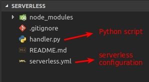

# Serverless and Python

This post is to show how easily is to use serverless framework, with python on aws lambda.

## Pre-requirements

* python 3.6
* boto3

```bash
sudo python3.6 -m pip install boto3
```

* node 8 & node package manager

```bash
curl -sL https://deb.nodesource.com/setup_8.x | sudo -E bash -
sudo apt-get install -y nodejs
sudo apt-get install -y npm
```

* serverless

```bash
sudo npm install -g serverless && \
sudo npm install --save serverless-python-requirements && \
sudo npm install serverless-domain-manager --save-dev

gustavo@localhost:~/github/serverless$ sls -v
1.28.0
gustavo@localhost:~/github/serverless$
```

## Create serverless structure

```bash
gustavo@localhost:~/github/serverless$ serverless create --template aws-python3
Serverless: Generating boilerplate...
 _______                             __
|   _   .-----.----.--.--.-----.----|  .-----.-----.-----.
|   |___|  -__|   _|  |  |  -__|   _|  |  -__|__ --|__ --|
|____   |_____|__|  \___/|_____|__| |__|_____|_____|_____|
|   |   |             The Serverless Application Framework
|       |                           serverless.com, v1.28.0
 -------'

Serverless: Successfully generated boilerplate for template: "aws-python3"
Serverless: NOTE: Please update the "service" property in serverless.yml with your service name
```

After that you should have the following structure:



## Editing serverless.yml and our python script

For more information you can read the following link
[aws serverless documentation](https://serverless.com/framework/docs/providers/aws/guide/serverless.yml)

* Editing deployment file

```yaml
# serverless.yml

service: serverless-test

package:
  exclude: # ignore unnecessary folder to generate lambda artifact
    - test_*
    - images/**
    - node_modules/**

provider:
  name: aws # cloud provider
  runtime: python3.6 # python version
  memorySize: 256 # lambda memory size
  tags:
    TAG_PROJECT: serverless-test
  vpc:
    # subnetIds: in this test is not necessary, just to 
    #   - subnet-xxxxxxx
    securityGroupIds:
      - Ref: LambdaSecurityGroup # reference from resources
  iamRoleStatements:
    - Effect: "Allow" # to invoke lambda
      Action:
        - "lambda:InvokeFunction"
        - "lambda:InvokeAsync"
        - "lambda:GetFunction"
      Resource:
        - "*"
    - Effect: "Allow"
      Action:
        - "execute-api:Invoke"
      Resource:
        - "arn:aws:execute-api:*:*:*"
functions:
  our-lambda:
    handler: handler.main
    timeout: 30
    environment:
      ENVIRONMENT: ${self:custom.stage}
      PROPERTIES: "{\"hello\":\"world\"}"
    events:
      - http:
          path: ping
          method: get
          cors: true
resources: 
  Resources:
    LambdaSecurityGroup:
      Type: 'AWS::EC2::SecurityGroup'
      Properties:
        GroupName: serverless-test-lambda-security-${self:custom.stage}
        GroupDescription: Security group for lambda access 
        #VpcId: vpc-xxxxxxx #for this example we do not need a vpc
        SecurityGroupIngress:
          - IpProtocol: TCP
            FromPort: 80
            ToPort: 80
            CidrIp: 10.0.0.0/8
          - IpProtocol: TCP
            FromPort: 443
            ToPort: 443
            CidrIp: 10.0.0.0/8
          - IpProtocol: TCP
            FromPort: 1433
            ToPort: 1433
            CidrIp: 10.0.0.0/8

plugins:
  - serverless-python-requirements
  - serverless-domain-manager
custom:
  stage: ${opt:stage, self:provider.stage}
  domains: # create domain for this lambda
    develop: serverless-test-develop.your-domain.com
    production: serverless-test.your-domain.com

  customDomain: # create stage path 
    basePath: ''
    domainName: ${self:custom.domains.${self:custom.stage}}
    stage: "${self:custom.stage}"
    createRoute53Record: true

  pythonRequirements:
    dockerizePip: non-linux # install dependences on docker only for windows, use py36 pip locally
```

* Editing handler python file

```python
import json
import os

json_return = os.getenv("PROPERTIES")


def main(event, context):
    body = {
        "message": "Go Serverless v1.0! Your function executed successfully!",
        'json_return': json_return
    }

    response = {
        "statusCode": 200,
        "body": json.dumps(body)
    }

    return response
```

## Create lambda stack

First we should create our domain

```bash
sls create_domain --stage develop
```

If everything has ran fine, you will see the following message

```bash
gustavo@localhost:~/github/serverless$ sls create_domain --stage develop
Serverless: 'serverless-test-develop.your-domain.com' was created/updated. New domains may take up to 40 minutes to be initialized.
gustavo@localhost:~/github/serverless$
```

We do not need to wait 40 minutes, to continue. So lets create your lambda stack now.

```bash
#sls deploy --stage {stage}
gustavo@localhost:~/github/serverless$ sls deploy --stage develop

  Error --------------------------------------------------

  ENOENT: no such file or directory, open 'requirements.txt'

     For debugging logs, run again after setting the "SLS_DEBUG=*" environment variable.

  Get Support --------------------------------------------
     Docs:          docs.serverless.com
     Bugs:          github.com/serverless/serverless/issues
     Issues:        forum.serverless.com

  Your Environment Information -----------------------------
     OS:                     linux
     Node Version:           8.10.0
     Serverless Version:     1.28.0

gustavo@localhost:~/github/serverless$
```

If you got the error ahead, try to create a empty `requirements.txt` file, and run it again.

```bash
gustavo@localhost:~/github/serverless$ sls deploy --stage develop
Serverless: Installing requirements of requirements.txt in .serverless...
Serverless: Packaging service...
Serverless: Excluding development dependencies...
Serverless: Injecting required Python packages to package...
Serverless: Uploading CloudFormation file to S3...
Serverless: Uploading artifacts...
Serverless: Uploading service .zip file to S3 (1.97 KB)...
Serverless: Validating template...
Serverless: Updating Stack...
Serverless: Checking Stack update progress...
..............
Serverless: Stack update finished...
Service Information
service: serverless-test
stage: develop
region: us-east-1
stack: serverless-test-develop
api keys:
  None
endpoints:
  GET - https://1234567890.execute-api.us-east-1.amazonaws.com/develop/ping
functions:
  our-lambda: serverless-test-develop-our-lambda
Serverless Domain Manager Summary
Domain Name
  serverless-test-develop.your-domain.com
Distribution Domain Name
  dfi4c4wdpknrk.cloudfront.net
Serverless: Removing old service artifacts from S3...
```

## Test it

```bash
gustavo@localhost:~/github/serverless$ curl -XGET 'https://1234567890.execute-api.us-east-1.amazonaws.com/develop/ping'
{"message": "Go Serverless v1.0! Your function executed successfully!", "json_return": "{\"hello\":\"world\"}"}

# or

gustavo@localhost:~/github/serverless$ curl -XGET 'https://serverless-test-develop.your-domain.com/ping/'
{"message": "Go Serverless v1.0! Your function executed successfully!", "json_return": "{\"hello\":\"world\"}"}
```

Congratulations, you created your first serverless API!

## Clean up

```bash
gustavo@localhost:~/github/serverless$ sls delete_domain --stage develop
Serverless: Domain was deleted.
gustavo@localhost:~/github/serverless$ sls remove --stage develop
Serverless: Getting all objects in S3 bucket...
Serverless: Removing objects in S3 bucket...
Serverless: Removing Stack...
Serverless: Checking Stack removal progress...
................
Serverless: Stack removal finished...

```