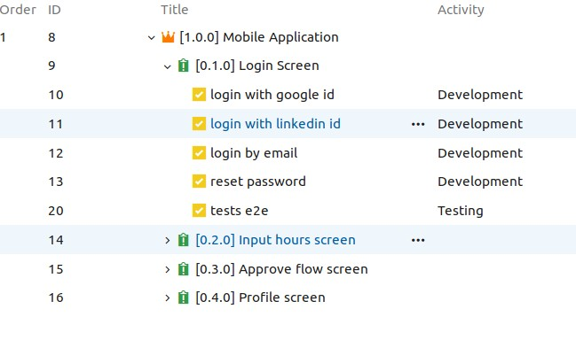

# DevOps Journey - Part 2: Source Control Rules

[//]: # "@Author : Gustavo F (gustavo@gmf-tech.com)"
[//]: # "@Link   : https://github.com/sharkguto"
[//]: # "@Date   : 24/03/2019 16:07:35"

## Overview

I do not like the idea to use git branches to generate artifact (like git-flow). My experience with that , always merge will be the villain, all environments will be a mess, and of course, it will generate recurrent bugs, downtime in application and profit loss… The way what I found to solve this is, to standardize the work, according to the delivery of the activities, at the code level.

As I explained before ([DevOps Journey - Part 1: Choose our weapons](weapons.md)), we will use the Basic Board View, to make the things simple as possible, following the KISS principle, "_keep it simple, stupid_". :smile:

## Activities scenario



## Rules

1. The `master` branch will be the update always, because of this, it is protected and it will only accept merge by Pull Request.
2. All branches should follow the following pattern: `[story|issue]/[task_id]`

   e.g. git branch story/123 master or git branch issue/123 master

3. All commits should follow the following pattern: `#[task_id] - [description of what you done in max 255 characters]`

   e.g. #70 - Implement social login with linkedin

4. When developer open the Pull Request, it should be link all activity tasks on it, for traceability purpose. And before open it , should have merge master into the branch.
5. Any branch opened should be create based on `master` branch. If not, should be reject!

## Hands-on

1. Branch policies
   | Approval & resolution                  | Merge strategy                         |
   | -------------------------------------- | -------------------------------------- |
   |  |  |
2. Branch creation standard

    ```bash
    gustavo@notebook ~/github-projects/BACKLOG $ git branch issue/9 master
    gustavo@notebook ~/github-projects/BACKLOG $ git checkout issue/9
    Switched to branch 'issue/9'
    gustavo@notebook ~/github-projects/BACKLOG $ git push -u origin issue/9
    Branch 'issue/9' set up to track remote branch 'issue/9' from 'origin'.
    Everything up-to-date
    gustavo@notebook ~/github-projects/BACKLOG $
    ```

3. Commit standard

    ```bash
    gustavo@notebook ~/github-projects/BACKLOG $ git status
    At branch issue/9
    Your branch is up to date with 'origin/issue/9'.

    gustavo@notebook ~/github-projects/BACKLOG $ git add .
    gustavo@notebook ~/github-projects/BACKLOG $ git commit -m '#10 update readme'
    [issue/9 60a695f] #10 update readme
    1 file changed, 5 insertions(+), 1 deletion(-)
    gustavo@notebook ~/github-projects/BACKLOG $ git push
    Counting objects: 3, done.
    ```

4. Open Pull Request
    
    \* If the master branch not been merged it will show the following message:
    
    It is recommend for the developer, before open PR, merge branch with master, to not get possible merge conflicts.
    After PR is completed, all taks will be closed by it.
    

5. Results

   Using squash merge strategy, it is much more simple to visualize the changes, because the master branch will be always updated
   
   for more information [squash merge PR](https://docs.microsoft.com/en-us/azure/devops/repos/git/merging-with-squash?view=azure-devops)

## Next steps

- [DevOps Journey - Part 3: The importance of Unit tests & Coverage](covtest.md)
- [DevOps Journey - Part 4: End 2 End automation tests](e2etests.md)
- [DevOps Journey - Part 5: Automatic Deployment & Integrations](pipelines.md)
