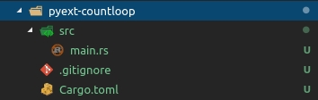
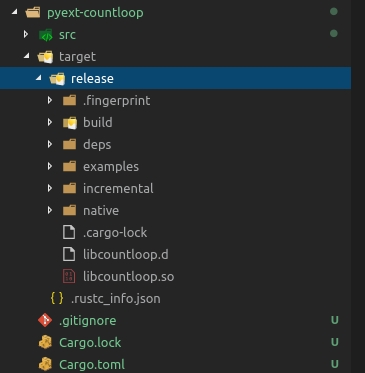
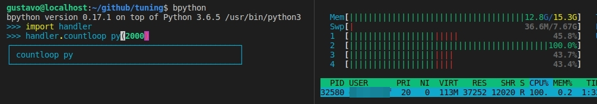
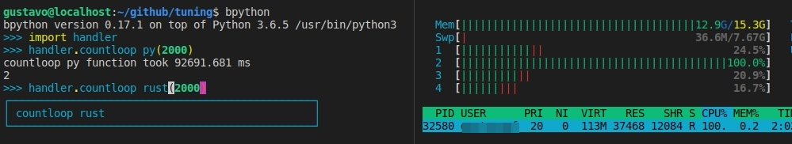
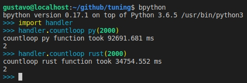

# Rust s2 Python, a true love

Sometimes we face some situations like: Python is taking too much time to run.

Just imagine the scenario, you need high CPU process synchronous per each core, to do some calculations with bigint values, in a nested loop. In 90% of the cases, pure python solves your problem, but sometimes you need to do some tunning and this is the current case.

So... Let's stop talking and put our hands on it.

## pre-requirements

install the following requirements

1. [Rust compiler](https://www.rust-lang.org/en-US/install.html)
2. Python3.6
3. A linux machine :)

## creating a new project in rust
https://github.com/sharkguto/shark-docs/blob/master/tuning/README.md
First of all we will use the nightly build to get all features available in rust.

```bash
gustavo@localhost:~/github/tuning$ rustup default nightly
info: using existing install for 'nightly-x86_64-unknown-linux-gnu'
info: default toolchain set to 'nightly-x86_64-unknown-linux-gnu'

  nightly-x86_64-unknown-linux-gnu unchanged - rustc 1.29.0-nightly (12ed235ad 2018-07-18)

gustavo@localhost:~/github/tuning$
```

Now, let's create our new library package

```bash
gustavo@localhost:~/github/tuning$ cargo new pyext-countloop
     Created binary (application) `pyext-countloop` project
gustavo@localhost:~/github/tuning$
```

The folder's tree structure should look like this:



After that, we are going to rename our `main.rs` to `lib.rs` and start creating our cargo file (cargo is the package manager for rust).

## cargo dependences

Let's edit the file `Cargo.toml` as the following example:

```toml
[package]
name = "pyext-countloop"
version = "0.2.0"
authors = ["Gustavo Freitas <gustavo@gmf-tech.com>"]

[lib]
name = "countloop"
crate-type = ["cdylib"]

[dependencies.cpython]
version = "0.2.0"
features = ["extension-module"]

[dependencies]
ramp = "0.5.0"

[features]
# This is examined by ./build.rs to determine which python version 
# to try to bind to.
default = ["python-3"]

# Bind to any python 3.x.
python-3 = []

# Or, bind to a particular minor version.
python-3-4 = []
python-3-5 = []
python-3-6 = []
```

## Coding our library

In Python

```python
def countloop_py(times):
    resp = 0
    for i in range(times):
        for x in range(i):
            resp = (x**i) % 5

    return resp
```

In Rust

```rust
#[macro_use]

extern crate cpython;
extern crate ramp;
use cpython::{PyResult, Python};
use ramp::Int;

fn countloop_rust(_py: Python, times: &str) -> PyResult<u64> {
    let mut resp = Int::from(0);
    let loops: usize = times.parse::<usize>().unwrap();

    for i in 0..loops {
        for x in 0..i {
            let a = Int::from(x).pow(i);
            resp = a % 5;
        }
    }

    Ok(u64::from(&resp))
}

py_module_initializer!(countloop, initcountloop, PyInit_countloop, |py, m| {
    try!(m.add(py, "__doc__", "This module is implemented in Rust"));
    try!(m.add(py, "countloop", py_fn!(py, countloop_rust(val: &str))));
    Ok(())
});
```

## compile library

First we need to build our library, using the following command

```bash
cargo build --release --verbose
```

After the compilation, our lib will be inside the target/release folder.



So lets move it to the root folder and fix lib to the correct name.

```bash
gustavo@localhost:~/github/tuning/pyext-countloop$ FILE=$(ls target/release/libcountloop* | grep .so)
gustavo@localhost:~/github/tuning/pyext-countloop$ NEWFILE=$(echo $FILE | sed 's/.*\///' |sed 's/lib//g')
gustavo@localhost:~/github/tuning/pyext-countloop$ mv $FILE ../$NEWFILE
gustavo@localhost:~/github/tuning/pyext-countloop$ cd ..
gustavo@localhost:~/github/tuning$ ls
countloop.so  handler.py  images  pyext-countloop  README.md
gustavo@localhost:~/github/tuning$
```

## Check performance




```bash
gustavo@localhost:~/github/tuning$ bpython
bpython version 0.17.1 on top of Python 3.6.5 /usr/bin/python3
>>> import handler
>>> handler.countloop_py(2000)
countloop_py function took 92691.681 ms
2
>>> handler.countloop_rust(2000)
countloop_rust function took 34754.552 ms
2
>>>
```


